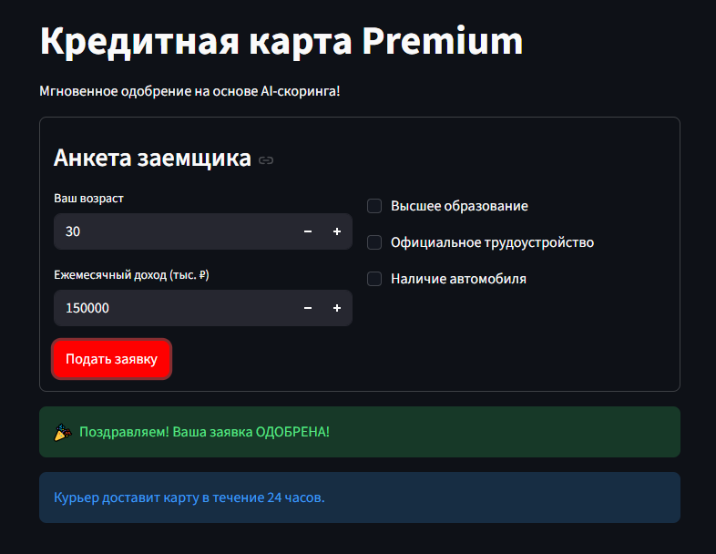
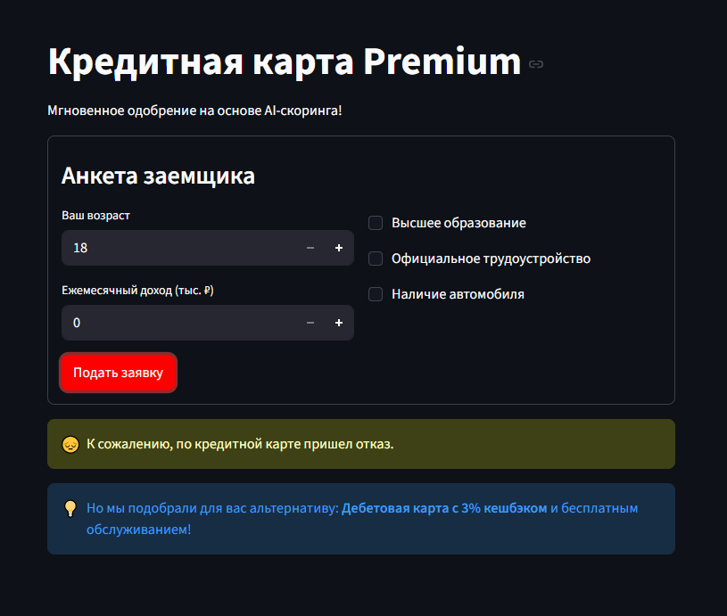

# AI Credit Scoring ML Pipeline

[](https://www.python.org/downloads/)
[](https://fastapi.tiangolo.com/)
[](https://streamlit.io/)
[](https://opensource.org/licenses/MIT)

**End-to-End ML пайплайн для кредитного скоринга** — от разведочного анализа данных до веб-приложения с API.

---

## Оглавление

- [О проекте](#о-проекте)
- [Демонстрация работы](#демонстрация-работы)
- [Архитектура](#архитектура)
- [Датасет](#датасет)
- [Быстрый старт](#быстрый-старт)
- [Стек технологий](#стек-технологий)
- [Метрики модели](#метрики-модели)
- [Автор](#автор)

---

## О проекте

Проект демонстрирует **полный цикл разработки ML-продукта** для кредитного скоринга:

✅ Разведочный анализ данных (EDA)  
✅ Обучение модели с балансировкой классов  
✅ REST API на FastAPI для инференса  
✅ Интерактивный веб-интерфейс на Streamlit  

## Демонстрация работы

### Веб-интерфейс Streamlit

*Интерфейс подачи заявки на кредитную карту*

### Отказ


**Особенности:**
- Использование реальных признаков из кредитного скоринга (Т-Банк)
- Балансировка классов для работы с дисбалансом данных
- Масштабирование признаков для улучшения качества модели
- Валидация данных через Pydantic
- Логирование всех запросов

 **[Открыть ноутбук с EDA анализом](exploratory_analysis.ipynb)**

---

## Архитектура

**Компоненты системы:**

1. **`src/train.py`** — ML пайплайн: обучение Logistic Regression с StandardScaler
2. **`src/service.py`** — FastAPI микросервис с валидацией данных через Pydantic
3. **`app.py`** — Веб-интерфейс на Streamlit для подачи заявок
4. **`exploratory_analysis.ipynb`** — Разведочный анализ данных

**Схема работы:**

Streamlit (Frontend) → FastAPI (Backend) → ML Model (Scikit-Learn)


---

## Датасет

Проект использует данные, структурированные по принципу реальных кредитных скоринговых моделей (вдохновлено датасетами **Т-Банка**).

**Признаки:**

| Признак | Тип | Описание |
|---------|-----|----------|
| `age` | Числовой | Возраст заемщика |
| `income` | Числовой | Ежемесячный доход (тыс. ₽) |
| `education` | Бинарный | Наличие высшего образования |
| `work` | Бинарный | Официальное трудоустройство |
| `car` | Бинарный | Наличие автомобиля |

**Целевая переменная:** `default` (1 = дефолт, 0 = успешное погашение)

> **Проблема дисбаланса классов**  
> В реальных кредитных данных дефолтов значительно меньше, чем успешных кредитов.  
> **Решение:** Используем `class_weight="balanced"` для повышения Recall.

---

## Быстрый старт

### Шаг 1: Установка зависимостей

```bash
pip install -r requirements.txt
```
### Шаг 2: Обучение модели
```bash
python src/train.py
```
После выполнения в папке models/ появятся файлы:
model.pkl — обученная модель Logistic Regression
scaler.pkl — StandardScaler для масштабирования признако

### Шаг 3: Запуск API сервиса
```bash
uvicorn src.service:app --reload
```
Сервис будет доступен по адресу: http://127.0.0.1:8000
Swagger документация: http://127.0.0.1:8000/docs

### Шаг 4: Запуск веб-интерфейса
Откройте новый терминал и выполните:
```bash
streamlit run app.py
```
Интерфейс будет доступен по адресу: http://localhost:8501

## Стек технологий
- Machine Learning: Scikit-Learn: Logistic Regression, StandardScaler
- Pandas: обработка данных
- NumPy: численные операции

**Backend:**
- FastAPI: REST API
- Pydantic: валидация данных
- Uvicorn: ASGI сервер

**Frontend:**
- Streamlit: интерактивный веб-интерфейс

**Tools:**
- Git: контроль версий
- Jupyter Notebook: EDA анализ
## Метрики модели
| Метрика | Значение | Описание |
|---------|-----|----------|
| `Precision` | ~0.75 | Минимизация ложных одобрений |
| `Recall` | ~0.70 | Выявление реальных рисков |
| `F1-Score` | ~0.72 | Сбалансированная метрика |

**Особенности обучения:**
> Использован class_weight="balanced" для работы с дисбалансом классов
> Обязательное масштабирование признаков (StandardScaler)
> Разделение данных: 80% train / 20% test
> Сохранение скейлера вместе с моделью для корректного инференса

## 👤 Автор  
- Mikhail Demashov (Демашов Михаил)
- Email: noo_noo1999@mail.ru
- Location: Saint Petersburg, Russia
- 🔗 GitHub: github.com/devfounder1